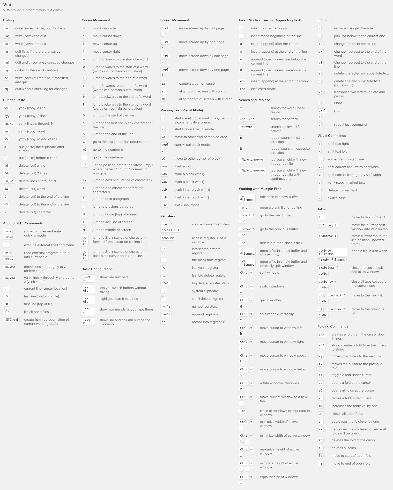

# Vim notes 📔

## Modes
In Vim we have three modes when we are editing a file.

1. Command mode.
2. Insert mode.
3. Last line mode.

### Command mode
> To access this mode, press `ESC`.

In the command mode we will be able to press keyboard keys and execute some commands with them, for
example, if we press `dd`, the current line, where the cursor is, will be deleted (now would be copied
to clipboard and could be pasted bye pressing `p` key).

This is the CheatSheet fot Vim commands:

### Insert mode
> To access this mode enter to `Command mode`, then press `i`.

Now by being in `Insert mode` we can write text in the file.

### Last line mode
> To access this mode enter to `Command mode`, then press `:`

In `Last line mode` we enter many commands into Vim, for example:

#### Searching
This command will replace all matches in the file.
`:%s/ReplaceThis/ForThis/g`

This command will replace all matches too, but will ask for confirmation first.
`:%s/ReplaceThis/ForThis/gc

### Exiting Vim
For exit from Vim execute `:q`
For exit and save execute `:wq`
