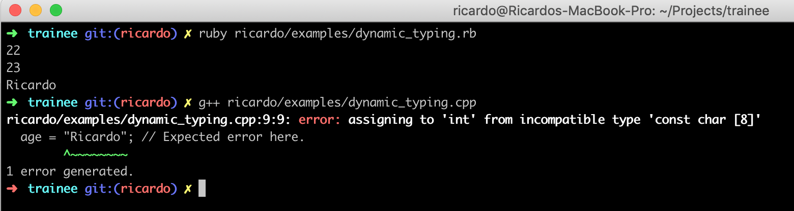

# Dynamic typing
Ruby is a dynamic typed language, that means that when don't need to define variables nor types,
just assign values to them, this has its odds and cons.

## Dynamic typing (Ruby)
```ruby
age = 22
age = 23
age = 'Ricardo'

# Ruby is ok with this, types are not an issue.
```

## Static typing (C++)
```cpp
int age = 22;
age = 23;
age = "Ricardo"; // ERROR

// C++ has not dynamic typing, so, it will produce an error, we need to use another variable.
```

## Real example
Here's an example of the output of above codes.


